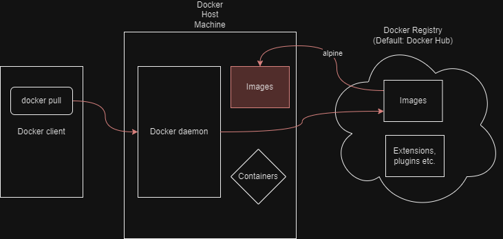
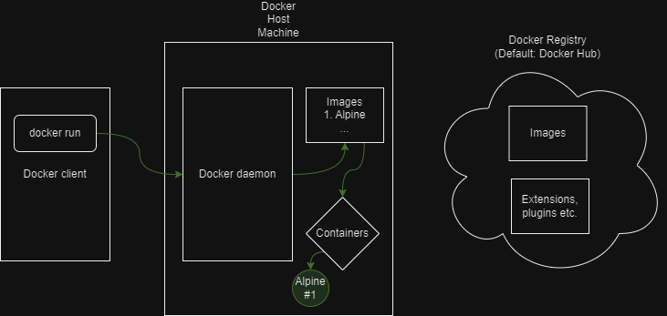

# CS3219: Docker and Kubernetes Lab
<p align= "center">

</p>

## Docker
Docker Docs defines Docker as follows: 
> _Docker is an open platform for developing, shipping, and running applications. Docker enables you to separate your applications from your infrastructure so you can deliver software quickly. With Docker, you can manage your infrastructure in the same ways you manage your applications. By taking advantage of Docker’s methodologies for shipping, testing, and deploying code quickly, you can significantly reduce the delay between writing code and running it in production._

The documentation can be found [here](https://docs.docker.com/).

### Introduction
Docker allows developers to package their applications and dependencies into a lightweight container by providing a layer of abstraction of OS-level virtualisation on Linux.

Docker containers are relatively well isolated from eachother and the host machine. So, developers can run their applications on any machine that has Docker installed, regardless of the underlying OS.

Unlike virtual machines, containers do not have high overhead and therefore able to efficiently use the system resources.

Apart from portability, Docker has many benefits, including:
1. **Streamlining [SDLC](## "Software Development Lifecycle")**: Allows developers to work in standardised environments with local containers. As such, containers are very useful in [CI/CD](## "continuous integration and continuous delivery/continuous deployment" ) workflows.  
2. **Scaling**: Docker's portability and lightweight nature allows for easy scaling of applications. It makes it easy to dynamically manage workloads, scale up/tear down applications and services as required, in almost real-time.
3. **Allowing multiple workloads on same hardware**: Docker provides a cost-effective alternative to virtual machines.  

### Installation and Setup
Please install Docker for your respective OS [here](https://docs.docker.com/get-docker/).

Please follow the instructions/install updates (if any). If successful, you will have installed Docker Desktop on your device. 

Docker Desktop provides a GUI to help manage containers, applications, images, etc. It can be used as is or as a complementary tool to the Docker CLI.

You can find what is included in Docker Desktop [here](https://docs.docker.com/desktop/).

Test your installation by running the following command in your terminal:
```bash
docker run hello-world
```
If successful, you should see something similar to the following output:
```bash
Hello from Docker!
This message shows that your installation appears to be working correctly.

To generate this message, Docker took the following steps:
 1. The Docker client contacted the Docker daemon.
 2. The Docker daemon pulled the "hello-world" image from the Docker Hub.
    (amd64)
 3. The Docker daemon created a new container from that image which runs the
    executable that produces the output you are currently reading.
 4. The Docker daemon streamed that output to the Docker client, which sent it
    to your terminal.

To try something more ambitious, you can run an Ubuntu container with:
 $ docker run -it ubuntu bash

Share images, automate workflows, and more with a free Docker ID:
 https://hub.docker.com/

For more examples and ideas, visit:
 https://docs.docker.com/get-started/
 ```

 > ⚠️ _**Warning**_ ⚠️
    > You will face errors if you don't start the Docker daemon before running the command. If you are using Docker Desktop, you can start the daemon by clicking on the Docker icon in your taskbar/open the Docker Desktop app. If you are using Docker CLI, you can start the daemon by running `dockerd` in your terminal (This option better applies to Linux users).

> 📝 **Note:** Running your terminal and Docker at different privilege levels may cause issues. For example, running your terminal as an administrator and docker as a normal user may cause issues. If you face any issues, try running both at the same privilege level.

### Concepts and Terminologies
Before we get our hands dirty, lets familiarise ourselves with some of the common concepts and terminologies associated with Docker.

Docker uses a client-server architecture. The Docker _daemon_ is what builds, runs and distributes the Docker containers. A Docker client communicates with the _daemon_. These can run on same or different machines. The table below summarises the common terminologies used in Docker.

| Term | Desrciption |
| --- | --- |
| Docker Daemon | Listens to Docker API requests. Manages Docker objects - images, containers, networks and volumes. It can also communicate with other daemons. |
| Docker Client | The primary way users interact with Docker. It sends commands to the Docker Daemon. It can communicate with >1 daemon. |
| Docker Desktop | A GUI tool that includes the Docker daemon, client, Docker Compose, Content Trust, Kubernetes, etc. |
| Docker Registry | A repository for Docker images. Docker Hub is the default registry. Using `docker pull` or `docker run` commands uses the required images from the configured registry. |
| Docker Objects | Images, containers, networks, volumes, plugins, etc. |
| Docker Images | Read-only templates used to create Docker containers. You can create your own image or use pre-existing ones. |
| Docker Container | A runnable instance of an image. You can create, start, stop, move, or delete a container using the Docker API or CLI. |

<sup> A part of this table was generated with the help of Github Copilot </sup>

### Running Your First Container with `docker run`
Now that we have Docker installed and have a basic understanding of Docker, lets run our first container.

> ⏰**Reminder**: Ensure that your Docker daemon is running before you proceed. You may do this by opening the Docker Desktop app or _running `dockerd` in your terminal (this option is for Linux users)_.

We'll run an Alpine Linux container (since it is a lightweight distribution of linux). You can try out the subsequent steps with other images as well - like BusyBox, Ubuntu, etc. 

Enter the command:
```bash
 docker pull alpine
```
This will pull the latest Alpine image from Docker Hub. You can find more information about the Alpine image [here](https://hub.docker.com/_/alpine).

If successful, you should see something similar to the following output:
```bash
Using default tag: latest
latest: Pulling from library/alpine
Digest: sha256:82d1e9d7ed48a7523bdebc18cf6290bdb97b82302a8a9c27d4fe885949ea94d1
Status: Image is up to date for alpine:latest
docker.io/library/alpine:latest

What's Next?
  View summary of image vulnerabilities and recommendations → docker scout quickview alpine
```

> ⚠️ _**Warning**_ ⚠️
> If you get a `permission denied` error, check you installation and setup. You may have to run the command as an administrator. If you are using linux  you may have to prefix your command with `sudo`. 



<sup> This an example of what happens when the `docker pull` command is executed to obtain the alpine image. </sup>

To check the images you have on your system, run the command:
```bash
docker images
```
You should see something akin to the following output:
```bash
REPOSITORY                              TAG       IMAGE ID       CREATED        SIZE
docker/welcome-to-docker                latest    912b66cfd46e   5 weeks ago    13.4MB
postgres                                <none>    696ffaadb338   6 weeks ago    237MB
alpine                                  latest    c1aabb73d233   6 weeks ago    7.33MB
hello-world                             latest    9c7a54a9a43c   2 months ago   13.3kB
```

Now we will run a Docker container based on this image that we just downloaded. For this, we'll use the `docker run` command.

```bash
docker run alpine ls -l
```
You should see something similar to the following output:
```bash
total 56
drwxr-xr-x    2 root     root          4096 Jun 14 15:03 bin
drwxr-xr-x    5 root     root           340 Jul 28 08:55 dev
drwxr-xr-x    1 root     root          4096 Jul 28 08:55 etc
drwxr-xr-x    2 root     root          4096 Jun 14 15:03 home
....
```
Basically what we did was run the `ls -l` command on the Alpine image. This command lists the contents of the current directory. 



<sup> This an example of what happens when the `docker run` command is executed for an Alpine container. </sup>

Lets try some more commands in the container. Run the following:
```bash
docker run alpine echo "hello from alpine"
```

What are your results? The output should be:
```bash
hello from alpine
```
Docker essentially ran the `echo` command in the alpine container and exited it. This is normal behaviour. To stay in the container and keep it running, we can use the `-it` flag. This flag allows us to interact with the container.

```bash
docker run -it alpine
```
You will enter the containers shell. You can now run commands in the container. 
```bash
/ # ls
bin    dev    etc    home   lib    media  mnt    opt    proc   root   run    sbin   srv    sys    tmp    usr    var
/ # cd bin
/bin # cd ..
/ #
```
You can exit the container by running the `exit` command.

To see the containers you are **currently** running, use the `docker ps` command.
```bash
docker ps
```
Output:
```bash
CONTAINER ID   IMAGE     COMMAND   CREATED   STATUS    PORTS     NAMES
```
As you can see, nothing is running right now. Try using the `-a` flag to see all containers that have been run on your system.
```bash
docker ps -a
```
Output:
```bash
CONTAINER ID   IMAGE         COMMAND                  CREATED          STATUS                      PORTS     NAMES
6b9fc12296f2   alpine        "/bin/sh"                3 minutes ago    Exited (0) 2 minutes ago              great_curie
0a57257081b8   alpine        "/bin/sh"                5 minutes ago    Exited (0) 5 minutes ago              friendly_lalande
de280dc604e1   alpine        "echo 'hello from al…"   12 minutes ago   Exited (0) 12 minutes ago             fervent_wiles
c009ae1dded7   alpine        "ls -l"                  38 minutes ago   Exited (0) 38 minutes ago             epic_galois
2c323cbabfb5   hello-world   "/hello"                 26 hours ago     Exited (0) 26 hours ago               zen_noyce
```

Yay! You successfully ran your first container. 🎉

Now that you are equipped with the basics, lets get to the interesting part - deploying web applications with Docker.

